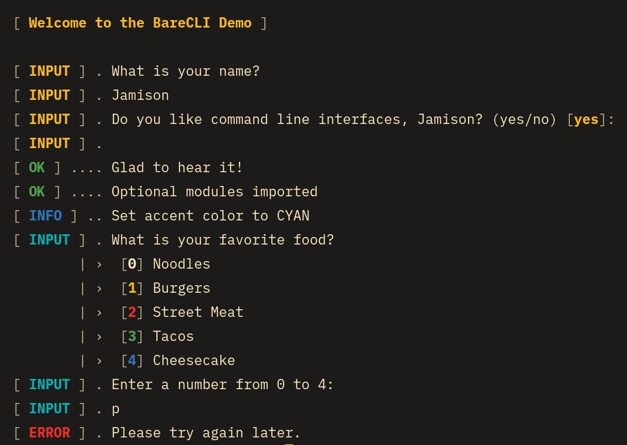

# BareCLI

BareCLI is a small styling framework to keep your CLI program code semantic
by doing all of the input and output styling for you. BareCLI's methods
are inspired by [Symfony's Command style helpers](https://symfony.com/doc/current/console/style.html)
and its aesthetic is inspired by systemd's service log that is displayed
when some Linux distros shut down a computer.

## Usage

**TODO**

